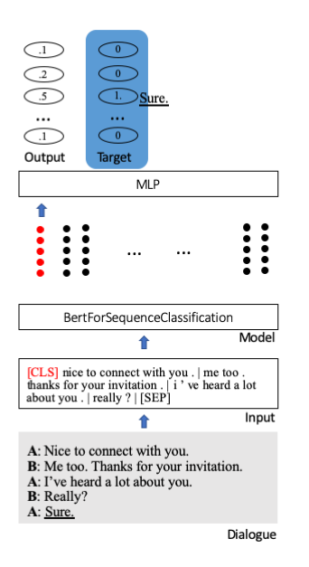
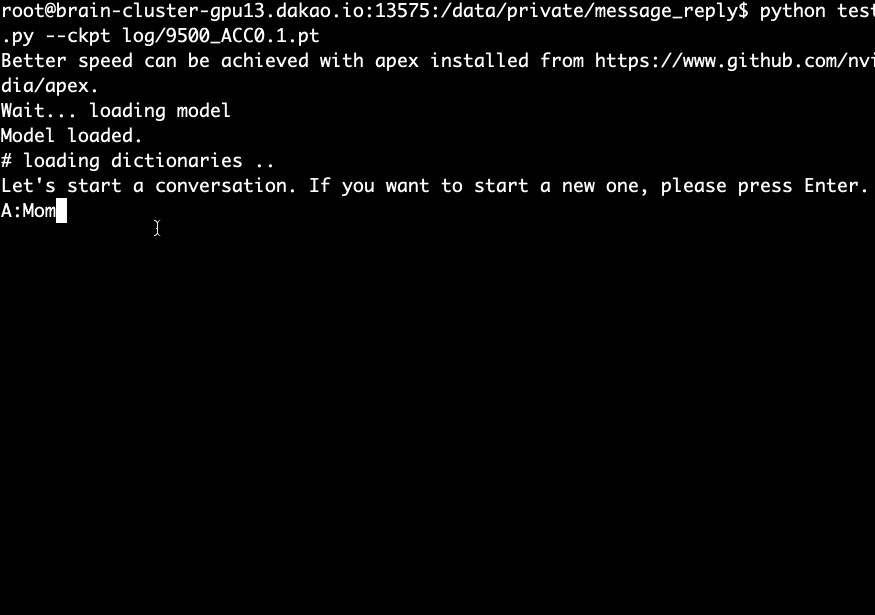

# Smart Message Reply

Have you ever seen or used [Google Smart Reply](https://firebase.google.com/docs/ml-kit/generate-smart-replies)? It's a service that provides automatic reply suggestions for user messages. See below.


This is a useful application of the retrieval based chatbot. Think about it. How many times do we text a message like <i>thx</i>, <i>hey</i>, or <i>see you later</i>?
In this project, we build a simple message reply suggestion system.

Kyubyong Park <br>
Code-review by [Yj Choe](https://github.com/yjchoe)

## Synonym group
* We need to set the list of suggestions to show. Naturally, frequency is considered first. But what about those phrases that are similar in meaning? For example, should <i>thank you so much</i> and <i>thx</i>be treated independently? We don't think so. We want to group them and save our slots. How? We make use of a parallel corpus. Both <i>thank you so much</i> and <i>thx</i> are likely to be translated into the same text. Based on this assumption, we construct English synonym groups that share the same translation.

## Model
We fine-tune [huggingface's](https://github.com/huggingface/pytorch-pretrained-BERT) the [Bert](https://arxiv.org/abs/1810.04805) pretrained model for sequence classification. In it, a special starting token [CLS] stores the entire information of a sentence. Extra layers are attached to project the condensed information to classification units (here 100).



## Data
* We use [OpenSubtitles 2018](http://opus.nlpl.eu/OpenSubtitles-v2018.php) Spanish-English parallel corpus to construct synonym groups. OpenSubtitles is a large collection of translated movie subtitles. The en-es data consists of more than 61M aligned lines.
* Ideally, a (very) large dialog corpus is needed for training, which we failed to find. We use the Cornell Movie Dialogue Corpus, instead. It's composed of 83,097 dialogues or 304,713 lines.

## Requirements
* python>=3.6
* tqdm>=4.30.0
* pytorch>=1.0
* pytorch_pretrained_bert>=0.6.1
* nltk>=3.4

## Training
* STEP 0. Download OpenSubtitles 2018 Spanish-English Parallel data.
```
bash download.sh
```

* STEP 1. Construct synonym groups from the corpus.
```
python construct_sg.py
```
* STEP 2. Make phr2sg_id and sg_id2phr dictionaries.
```
python make_phr2sg_id.py
```
* STEP 3. Convert a monolingual English text to ids.
```
python encode.py
```
* STEP 4. Create training data and save them as pickle.
```
python prepro.py
```
* STEP 5. Train.
```
python train.py
```

## Test (Demo)



* Download and extract the [pre-trained model](https://www.dropbox.com/s/fqomn5flbwlvndc/log.tar.gz?dl=0) and run the following command.
```
python test.py --ckpt log/9500_ACC0.1.pt
```

## Notes
* Training loss slowly but steadily decreases.
* Accuracy@5 on the evaluation data is from 10 to 20 percent.
* For real application, a much much larger corpus is needed.
* Not sure how much movie scripts are similar to message dialogues.
* A better strategy for constructing synonym groups is necessary.
* A retrieval-based chatbot is a realistic application as it is safter and easier than generation-based one.

